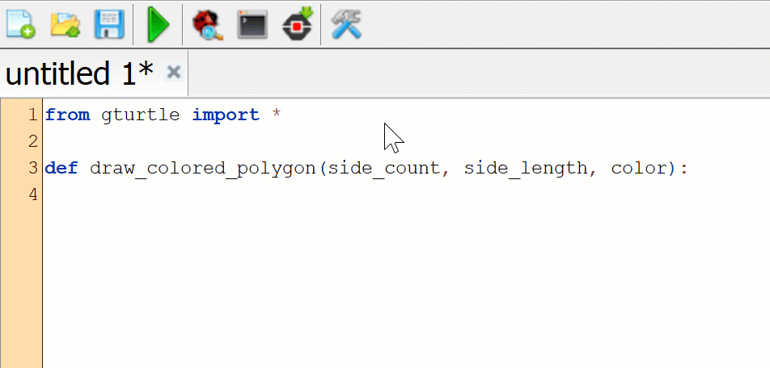
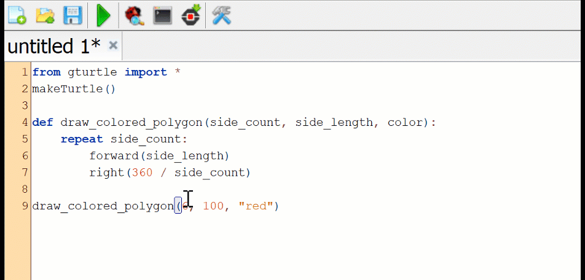
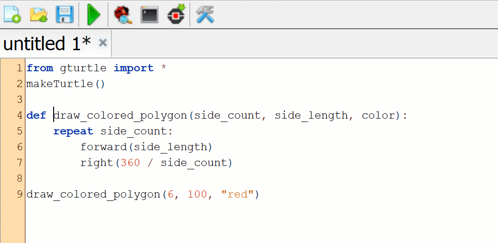
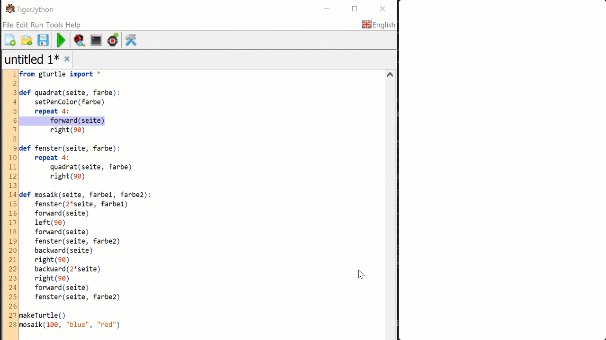

# Lösungen zum Kapitel 3

## Aufgabe 1

```python
from gturtle import *

makeTurtle()

def sechseck(seite):
    repeat 6:
        forward(seite)
        right(360 / 6)

def gehe_nach_rechts(abstand):
    penUp()
    right(90)
    forward(abstand)
    left(90)
    penDown()

# Zeichne Figuren
sechseck(80)
gehe_nach_rechts(150)
sechseck(96)
```

## Aufgabe 2

```python
from gturtle import *

makeTurtle()

def vieleck50(anzahl_ecken):
    repeat anzahl_ecken:
        forward(50)
        right(360 / anzahl_ecken)

def gehe_nach_rechts(abstand):
    penUp()
    right(90)
    forward(abstand)
    left(90)
    penDown()

# Zeichne Figuren
vieleck50(5)
gehe_nach_rechts(100)
vieleck50(8)
```

## Aufgabe 3

```python
from gturtle import *

makeTurtle()

def farb_dreieck(seite, farbe):
    setPenColor(farbe)
    repeat 3:
        forward(seite)
        right(360 / 3)

def gehe_nach_rechts(abstand):
    penUp()
    right(90)
    forward(abstand)
    left(90)
    penDown()

# Zeichne Figuren
farb_dreieck(70, "red")
gehe_nach_rechts(90)
farb_dreieck(70, "green")
gehe_nach_rechts(90)
farb_dreieck(70, "blue")
gehe_nach_rechts(90)
```

## Aufgabe 4

::: danger Fehler im Buch

Sollte im Buch nicht `vielecke(10, 36, "rot")` sondern `vieleck(10, 36, "red")`
sein !!!

Link : https://www.notion.so/1424f516226748d983c1d9cff59e4fa2?v=80f5699b7677497bb0034309f8d76dcb&p=53f81fc19b5547779631b61bb24582d6

:::

```python
from gturtle import *

makeTurtle()

# COMMENT: Befehl heißt km Buch `vielecke` ... sollte nicht `vieleck` sein ?
def vielecke(seite, ecken, farbe):
    setPenColor(farbe)
    repeat ecken:
        forward(seite)
        right(360 / ecken)

vielecke(10, 36, "red")
vielecke(20, 72, "blue")
```

## Aufgabe 5

```python
from gturtle import *

makeTurtle()

def kreis_bogen(winkel, bogen_laenge):
    repeat winkel:
        forward(bogen_laenge // winkel)
        right(1)

def blatt(winkel, bogen_laenge):
    left(winkel / 2)
    repeat 2:
        kreis_bogen(winkel, bogen_laenge)
        right((360 - 2 * winkel) / 2)
    right(winkel / 2)


blatt(60, 300)
right(90)
blatt(60, 150)
right(90)
blatt(120, 300)
right(90)
blatt(90, 300)
```

Diese Aufgabe ist nicht einfach und braucht noch einige zusätzliche Erklärungen und Schritte, wie man überlegen kann. Idealerweise sollte der Code in verschiedene Schritte entwickelt werden. Es sollten auch einige Vorschläge für die LP geben.

Man könnte auch als Zusatzstoff die Länge des Blattes (und nicht des Kreisbogens) als Parameter angeben. Das ist aber Mathematisch viel schwieriger zu tun. Es könnte aber Raum für Experimentieren geben.

## Aufgabe 6

```python
from gturtle import *

makeTurtle()

def zeichne_stufe(hoehe, laenge):
    forward(hoehe)
    right(90)
    forward(laenge)
    left(90)


def treppe(anzahl_stufen, hoehe, laenge):
    repeat anzahl_stufen:
        zeichne_stufe(hoehe, laenge)

treppe(8, 16, 21)
```

## Aufgabe 7

Die Reihenfolge der Parameter auf Zeile 10 muss geändert werden. Der Befehl `farb_dreieck(s, f)` muss also wie folgt aufgerufen werden:

```python
farb_dreieck(100, "red")
```

Das vollständige Programm sollte also etwa so aussehen

```python
from gturtle import *

def farb_dreieck(s, f):
    setPenColor(f)
    repeat 3:
        forward(s)
        left(360 / 3)

makeTurtle()
farb_dreieck(100, "red")
```

Noch besser wäre aber, die Parameternamen deutlicher zu machen. Mit so unklare
einbuchstabigen Namen versteht man am Programm nichts, ohne den ganze Code jedes
Mal.

```python
from gturtle import *

def farb_dreieck(seite, farbe):
    setPenColor(farbe)
    repeat 3:
        forward(seite)
        left(360 / 3)

makeTurtle()
farb_dreieck(100, "red")
```

## Denkpause

Parameter sollten möglichst sinnvolle Namen haben, um das Programm
übersichtlicher und verständlicher zu machen. Das Programm sollte nicht nur für
den Computer geschrieben werden aber auch für die Leute, die es nachher lesen,
verstehen und eventuell verändern müssen.

Im Kontext des Programmierunterricht heißt das die Lehrperson und die andere
SuS. In der Industrie ist das noch wichtiger, weil die Programme sehr oft
absolut kritische Systeme wie Flugzeuge, das Internet oder Zugsteuerungssysteme
steuern. In so kritische Gebiete darf einfach kein dummer Fehler passieren.

Der Fehler von Maria in Aufgabe 7 tritt vor allem auf, weil die Befehlsparameter
nicht sinnvoll benannt wurden.

Sie sollten sich daran gewöhnen, Ihre Befehle, Variablen und Befehlsparameter
mit möglichst relevanten Namen zu benennen, um Ihre Programme verständlicher zu
machen und dumme Fehler zu vermeiden. Es ist besser, etwas längere Namen zu
verwenden, die aus einem oder zwei Wörtern bestehen, als zu versuchen, sie zu
verkürzen, um ein paar Zeichen zu gewinnen. Das lohnt sich auf langer Sicht
nicht aus. Sie sollten lieber die erweiterten Funktionen der TigerJython
Programmierumgebung kennenlernen.

::: tip Einige Tricks, um mit TigerJython schneller zu Programmieren ohne dumme Abkürzungen

- **Autovervollständigung**

  Die Desktop TigerJython Umgebung steht eine schöne Funktionalität zur
  Verfügung. Sie weiß an jeder Zeit, welche Befehle, Variablen oder Parameter
  früher definiert wurden. Beim Programmieren kann man nur die erste Buchstaben
  eines Namens eintippen und dann die Tastenkombination Ctrl + Leertaste auf der
  Tastatur drücken. TigerJython wird automatisch den Namen vervollständigen oder
  eine Wahl vorstellen.

  

- **Die Tastatur Effizient verwenden (Tastatur-Kurzbefehle)**

  1. Schnell im Code mit `Ctrl+Pfeiltaste` navigieren

     

  2. Schnell Text markieren und Kopieren (z.B eine ganze Zeile). Das Prinzip liegt darum, wie mit dem vorherigen Trick, sich mit `Ctrl+Pfeil` oder `Ctrl+Home` / `Ctrk+End` durch den Code zu bewegen aber noch zusätzlich die Taste "Großgeschrieben" zu drücken.

     

  3. Es gibt noch ganz viele solche Tastatur-Tricks, die beim Programmieren
     viel Zeit sparen können.

:::

### Verwendete Code für die Demonstration

```python
from gturtle import *
makeTurtle()

def draw_colored_polygon(side_count, side_length, color):
    repeat side_count:
        forward(side_length)
        right(360 / side_count)

draw_colored_polygon(6, 100, "red")
```

## Aufgabe 8

- Nach dem Aufruf

  ```python
  rechteck(150, 210, 3, "red")
  ```

  auf Zeile 12 (der 13 ... das sollte korrigiert werden) ist die
  Tabelle vom Befehl `rechteck` wie folgt:

  |    Name | Wert  |
  | ------: | ----- |
  |     `a` | 150   |
  |     `b` | 210   |
  |    `wd` | 3     |
  | `farbe` | "red" |

* Nach dem Aufruf

  ```python
  rechteck(184, 144, 1, "green")
  ```

  auf Zeile 13 (oder 14 ... das sollte korrigiert werden) ist die
  Tabelle vom Befehl `rechteck` wie folgt:

  |    Name | Wert    |
  | ------: | ------- |
  |     `a` | 184     |
  |     `b` | 144     |
  |    `wd` | 1       |
  | `farbe` | "green" |

## Aufgabe 9

Um so ein kompliziertes Programm zu verstehen muss man unbedingt mit Tabellen
dokumentieren, welcher Wert jede Variable an jedem Zeitpunkt besitzt.

```python
from gturtle import *

def quadrat(seite, farbe):
    setPenColor(farbe)
    repeat 4:
        forward(seite)
        right(90)

def fenster(seite, farbe):
    repeat 4:
        quadrat(seite, farbe)
        right(90)

def mosaik(seite, farbe1, farbe2):
    fenster(2*seite, farbe1)
    forward(seite)
    left(90)
    forward(seite)
    fenster(seite, farbe2)
    backward(seite)
    right(90)
    backward(2*seite)
    right(90)
    forward(seite)
    fenster(seite, farbe2)

makeTurtle()
mosaik(100, "blue", "red")
```

1.  Nach dem Aufruf `mosaik(100, "blue", "red")` auf Zeile 28 herstellt der
    Computer eine erste Tabelle :

    ::: details Zeige die Tabellen nach dem Aufruf von `mosaik` auf Zeile 28

    Tabelle von `mosaik(100, "blue", "red")` auf Zeile 28.

    |     Name | Wert   |
    | -------: | ------ |
    |  `seite` | 100    |
    | `farbe1` | "blue" |
    | `farbe2` | "red"  |

    :::

1.  Im Körper des Befehls `mosaik` wird auf Zeile 15 der Befehl `fenster(2 * seite, farbe1)` aufgerufen. Dabei herstellt der Computer
    eine neue Tabelle für die Parameter des Befehls `fenster`.
    Obwohl die Tabellen im Buch für Platz gründen nebeneinander gezeichnet sind,
    zeichnet man diese verschiedenen Tabellen üblicherweise übereinander gestapelt.
    Die Tabelle des letztaufgerufenen Befehles wird immer ganz oben am Stapel
    gezeichnet.

    ::: details beim Aufruf von `fenster` auf Zeile 15

    Tabelle von `fenster(2 * seite, farbe1)` (Aufruf auf Zeile 15 im Körper des
    Befehls `mosaik`)

    |    Name | Wert   |
    | ------: | ------ |
    | `seite` | 200    |
    | `farbe` | "blue" |

    Tabelle von `mosaik(100, "blue", "red")` (Aufruf auf Zeile 28 des Hauptprogramms)

    |     Name | Wert   |
    | -------: | ------ |
    |  `seite` | 100    |
    | `farbe1` | "blue" |
    | `farbe2` | "red"  |

    :::

1.  Bei der Ausführung des Befehls `fenster(2 * seite, farbe1)` wird der Befehl
    `quadrat(seite, farbe)` auf Zeile 11 aufgerufen, was wieder eine neue
    Tabelle für den Befehl `quadrat` herstellt.


    ::: details Zeige die Tabellen beim Aufruf von `quadrat` auf Zeile 11

    Tabelle von `quadrat(seite, farbe)` (Aufruf auf Zeile 11 im Körper des
    Befehls `fenster`)

    |    Name | Wert   |
    | ------: | ------ |
    | `seite` | 200    |
    | `farbe` | "blue" |

    Tabelle von `fenster(2 * seite, farbe1)` (Aufruf auf Zeile 15 im Körper des
    Befehls `mosaik`)

    |    Name | Wert   |
    | ------: | ------ |
    | `seite` | 200    |
    | `farbe` | "blue" |

    Tabelle von `mosaik(100, "blue", "red")` (Aufruf auf Zeile 28 des Hauptprogramms)

    |     Name | Wert   |
    | -------: | ------ |
    |  `seite` | 100    |
    | `farbe1` | "blue" |
    | `farbe2` | "red"  |

    :::

    Während der Ausführung des Körper der `repeat`-Schleife auf Zeile 10 wird
    also die obere `quadrat` Tabelle vier Mal hergestellt und dann nach der
    Ausführung des Befels `quadrat()` wieder gelöscht. Am Ende der Ausführung des
    Befehls `fenster` nach Zeile 15 wird auch noch die Tabelle für `fenster`
    gelöscht und es bleibt nur noch die Tabelle für `mosaik` übrig :

    ::: details Zeige die Tabellen beim Aufruf von `quadrat` auf Zeile 11

    Tabelle von `mosaik(100, "blue", "red")` (Aufruf auf Zeile 28 des Hauptprogramms)

    |     Name | Wert   |
    | -------: | ------ |
    |  `seite` | 100    |
    | `farbe1` | "blue" |
    | `farbe2` | "red"  |

1.  Bei der Ausführung `fenster(seite, farbe2)` auf Zeile 19 herstellt der Computer wieder
    eine neue Tabelle für den Befehl `fenster` aber mit anderen Werten als
    vorher :

    ::: details Zeige die Tabellen beim Aufruf von `fenster` auf Zeile 19

    Tabelle von `fenster(seite, farbe2)`

    |    Name | Wert  |
    | ------: | ----- |
    | `seite` | 100   |
    | `farbe` | "red" |

    Tabelle von `mosaik(100, "blue", "red")`

    |     Name | Wert   |
    | -------: | ------ |
    |  `seite` | 100    |
    | `farbe1` | "blue" |
    | `farbe2` | "red"  |

    :::

1.  Wie vorher, wird im Körper des Befehls `fenster` der Befehl `quadrat` vier
    Mal aufgerufen (Es wird also eine Tabelle für `quadrat` vier Mal hergestellt
    und dann gerade wieder gelöscht).

    ::: details Zeige die Tabellen beim Aufruf von `quadrat` auf Zeile 11

    Tabelle von `quadrat(seite, farbe)` (Aufruf auf Zeile 11 im Körper des
    Befehls `fenster`)

    |    Name | Wert  |
    | ------: | ----- |
    | `seite` | 100   |
    | `farbe` | "red" |

    Tabelle von `fenster(seite, farbe2)` (Aufruf auf Zeile 19 im Körper des
    Befehls `mosaik`)

    |    Name | Wert  |
    | ------: | ----- |
    | `seite` | 100   |
    | `farbe` | "red" |

    Tabelle von `mosaik(100, "blue", "red")` (Aufruf auf Zeile 28 des Hauptprogramms)

    |     Name | Wert   |
    | -------: | ------ |
    |  `seite` | 100    |
    | `farbe1` | "blue" |
    | `farbe2` | "red"  |

    :::

1.  Nach Zeile 19 bleibt wie nach Zeile 15 wieder nur die Tabelle für `mosaik`
    übrig.

1.  Dann kommt der Computer endlich am Ende des Körpers des Befehls `mosaik`,
    löscht die Tabelle für `mosaik` und springt wieder auf Zeile 28 zurück. Da
    es keine Anweisungen mehr zu ausführen gibt, kommt das Programm zu Ende und
    es bleibt keine Befehlstabelle mehr im Computerspeicher übrig.

::: tip Tip : TigerJython Debugger

Das Dokumentieren der verschiedenen Tabellen mit allen Werten ist sehr aufwändig.
Das wird für sehr grosse und komplizierte Programme überhaupt nicht machbar. Das
ist genau der Grund, warum die Profis im alltäglichen Programmieren sogenannte
**Debugger** verwenden, um die Programme besser zu verstehen und ihr
dynamisches Verhalten zu darstellen.

Die TigerJython Entwicklungsumgebung stellt auch ein solches Werkzeug zur
Verfügung. Die folgende Animation veranschaulicht, wie man das Debugger von
TigerJython verwenden kann, um diese aufeinander gestapelte Tabellen zu
erzeugen.


:::

## Denkpause 10

::: details Angabe

Was für eine Tabelle entsteht, wenn der Befehl `mosaik` noch eine weitere
Variable `farbe3` haben würde und der Aufruf in Zeile 25 `fenster(seite, farbe3)` wäre? Betrachten Sie den Aufruf `mosaik(50, "red", "green", "black")`.
Ist es nicht riskant, den Variablennamen `seite` in unterschiedlichen Befehlen
zu verwenden? Was könnten die Gründe dafür sein, dass wir dies trotz der
möglichen Verwirrung tun?

:::

Beim Aufruf `mosaik(100, "blue", "red", "black")` würde die folgende Tabelle
entstehen :

|     Name | Wert    |
| -------: | ------- |
|  `seite` | 100     |
| `farbe1` | "blue"  |
| `farbe2` | "red"   |
| `farbe3` | "black" |

Beim Aufruf `fenster(seite, farbe3)` au Zeile 25 würde den Speicher also die
folgende zwei Tabellen beinhalten :

::: details

Tabelle von `fenster(seite, farbe3)` (Aufruf auf Zeile 25 im Körper des
Befehls `mosaik`)

|    Name | Wert    |
| ------: | ------- |
| `seite` | 100     |
| `farbe` | "black" |

|     Name | Wert    |
| -------: | ------- |
|  `seite` | 100     |
| `farbe1` | "blue"  |
| `farbe2` | "red"   |
| `farbe3` | "black" |

:::

::: tip Notize

Von der Programmiersprache her ist das auf keinen Fall ein Problem. Der Computer
aufbewahrt die Variablen jedes Befehles in einer separaten Tabelle. Deswegen
kommen diese Variablen nie in Konflikt, obwohl sie den gleichen Namen haben. Wir
brauchen deshalb nicht unbedingt für jeden neue Befehl neue Parametername
auszufinden.

:::

## Aufgabe 10 (sollte 11 sein ...)

::: details Angabe

Definieren Sie einen Befehl `reihe`, der eine Reihe aus Quadraten zeichnet wie
in der Abbildung. Der Befehl soll zwei Variablen haben: eine für die Seitenlänge
eines Quadrats und eine für die Anzahl der Quadrate in der Reihe. Der Befehl
`reihe` soll den Befehl `quadrat(seite)` verwenden. Zeichnen Sie dann damit eine
Reihe von 15 Quadraten. Jedes Quadrat hat eine Seitenlänge von 24. Schreiben Sie
die Tabellen `reihe` und `quadrat` mit ihren Inhalten nach dem Aufruf von
`reihe(15, 24)` und `quadrat(seite)` auf.

:::

```python
from gturtle import *

makeTurtle()
speed(50)

def quadrat(seite):
    repeat 4:
        forward(seite)
        right(90)

def reihe(seite, anzahl):
    repeat anzahl:
        quadrat(seite)
        right(90)
        forward(seite)
        left(90)

reihe(24, 15)
```

Nach dem Aufruf `reihe(24, 15)` auf Zeile 18 werden die zwei folgende Tabellen
im Computerspeicher hergestellt :

Tabelle für den Befehl `quadrat`

|    Name | Wert |
| ------: | ---- |
| `seite` | 24   |

Tabelle für den Befehl `reihe`

|     Name | Wert |
| -------: | ---- |
|  `seite` | 24   |
| `anzhal` | 15   |

## Aufgabe 11 (sollte 12 sein ?)

```python
from gturtle import *

makeTurtle()
speed(50)

def quadrat(seite):
    repeat 4:
        forward(seite)
        right(90)

def reihe(seite, anzahl):
    repeat anzahl:
        quadrat(seite)
        right(90)
        forward(seite)
        left(90)

def gitter(m, n, seite):
    repeat m:
        reihe(seite, n)
        # Am Anfang der Reihe zurückgehen
        penUp()
        left(90)
        forward(n * seite)
        right(90)
        back(seite)
        penDown()

    # Die Schildkröte nach der Ecke unten rechts bewegen
    penUp()
    forward(seite)
    right(90)
    forward(seite * n)
    left(90)


gitter(3, 7, 50)
```

::: danger Achtung !

Die Tabellen müssen noch gezeichnet werden. Das ist aber viel Arbeit und wir
können nicht jedes Herstellen und Löschen dokumentieren.

Tabellen werden bei der Ausführung der Zeilen 37, 20 und 13 hergestellt und nach
der Ausführung jeweils wieder sofort gelöscht. Im Allgemeinen, sobald die
Ausführung eines Befehl zu Ende kommt, wird die Entsprechende Tabelle gelöscht.

:::

## Lernaufgabe 13

Die Schildkröte befindet sich nach der Ausführung von `pfeil()` an der Spitze des
Pfeils und schaut in die Richtung des Pfeils. So kann sie gerade einen anderen
Pfeil zeichnen kann, um den Baum zu zeichnen.

```python
from gturtle import *

def pfeil(w, alpha):
    forward(w)
    right(alpha)
    back(w)
    forward(w)
    left(2 * alpha)
    back(w)
    forward(w)
    right(alpha)

def baum(x, y, z, alpha):
    pfeil(z, alpha)
    pfeil(y, alpha)
    pfeil(x, alpha)

makeTurtle()

baum(100, 120, 140, 40)
```

## Aufgabe 12 (Sollte 14 sein)

::: details Angabe

Entwickeln Sie ein Programm `schach(seite, farbe1, farbe2)` zum Zeichnen
eines Schachbretts. Die Grösse der einzelnen Felder sowie die abwechselnden Farben
der Felder sollen frei wählbar sein. Gehen Sie dabei modular vor. Schreiben Sie zunächst
einen Befehl zum Zeichnen eines ausgefüllten Quadrates mit wählbarer Seitenlänge
und Farbe. Verwenden Sie anschliessend diesen Befehl, um die beiden unterschiedlichen
Zeilen des Schachbretts zu entwerfen. Schreiben Sie zuletzt einen Befehl,
der das Schachbrett aus den unterschiedlichen Zeilen zusammensetzt.
Rufen Sie anschliessend `schach(40, "yellow", "purple")` auf und dokumentieren
Sie die Entwicklung der Werte der Variablen in den unterschiedlichen Tabellen
für alle vier Befehle.

:::

::: tip Strategie

Für eine größere Aufgabe muss man sich die Strategie gut ausdenken und das
Programm schrittweise entwickeln und testen. Das wichtigste an dieser Aufgabe
ist Mustererkennung. Sie sollen zuerst die verschiedene Mustern, die sich immer wiederholen, erkennen. Das Schachbrett kann aus den drei Mustern, die auf dem Bild
dargestellt, gezeichnet werden.

#[Muster erkennung im Schachbrett](./chapter-03/schachbrett.png)

Sie könnten zum Beispiel so vorgehen:

1.  Ein Befehl `gefuelltes_quadrat(seite, farbe)` definieren. Dabei soll die
    Schildkröte in der Ecke oben links anfangen und unten rechts das Zeichnen beenden.

1.  Ein Paar von Quadraten mit alternierende Farbe mit einem Befehl
    `quadrat_paar(seite, farbe1, farbe2)` definieren. Das erlaubt schon, das
    Rote und Grüne Muster zu zeichnen, nämlich mit zwei verschieden Aufrufe

    ```python
    quadrat_paar(seite, farbe1, farbe2)
    quadrat_paar(seite, farbe2, farbe1)
    ```

1.  Eine Reihe von 8 Quadraten, also 4 Paaren von Quadraten. Die Reihe beginnt
    mit der Farbe `farbe1` und endet mit der Farbe `farbe2`. Damit kann man
    sowohl die Reihen, die mit `farbe1` beginnen als auch diejenigen die
    mit `farbe2` beginnen zeichnen. Beim Zeichnen der Reihe ist es wichtig, dass
    sich die Schildkröte an der richtigen

1.  Das Schachbrett besteht dann aus vier Wiederholungen des blauen Musters.

:::

::: tip Code Entwicklung / Test Driven Developement

Um größere Programme ohne Fehler zu entwickeln ist es wichtig, schrittweise zu
vorgehen. Das heißt konkret nach jedem Schritt der oben beschriebene Strategie
das Programm zu testen. Jeder einzelne Befehl sollte also für sich selbst
getestet werden und erst dann mit den anderen Befehle kombiniert werden, um die gesamte Aufgabe zu lösen.

Dieses Vorgehen nennen die Profis "Test Driven Development".

:::

```python
from gturtle import *

def quadrat(seite, farbe):
    setPenColor(farbe)
    repeat seite:
        forward(seite)
        back(seite)
        right(90)
        forward(1)
        left(90)

def quadrat_paar(seite, farbe1 ,farbe2):
    quadrat(seite, farbe1)
    quadrat(seite, farbe2)


def reihe(seite, farbe1, farbe2):
    repeat 4:
        quadrat_paar(seite, farbe1, farbe2)
    penUp()
    left(90)
    forward(8 * seite)
    right(90)
    back(seite)
    penDown()

def schach(seite, farbe1, farbe2):
    hideTurtle()
    repeat 4:
        reihe(seite, farbe1, farbe2)
        reihe(seite, farbe2, farbe1)
    showTurtle()

makeTurtle()

schach(30, "black", "white")

```

## Speicherinhalte ändern

## Denkpause

::: details fr (Wurde zuerst in FR geschrieben ... bitte überprüfen)

Fondamentalement, nous n'avons jusqu'à présent jamais modifié la valeur des
paramètres pendant l'exécution des commandes. Nous n'avons utilisé les
paramètres que pour transmettre des valeurs aux commandes et ainsi permettre de
les rendre plus flexibles et générales.

Dans l'exemple 8, les paramètres des fonctions ont certes pris des valeurs
différentes au cours de l'exécution du programme mais toujours dans le cadre
d'appels différents. Les valeurs n'ont jamais été modifées au cours de
l'exécution d'une commande. Pour prendre un exemple concret, la commande
`fenster(seite, farbe)` a été appelée à de multiples reprises avec des valeurs
différentes mais la valeur de `seite` au `farbe` n'a jamais changé au cours de
l'une de ces exécutions.

:::

Grundsätzlich haben wir bisher nie den Wert der
Variablen während der Befehlsausführung geändert. Wir haben die Parameter nur verwendet, um die Übertragung von Werten an die Befehle zu ermöglichen und somit sie flexibler und allgemeiner zu machen.

In Beispiel 8 haben die Parameter der Befehle zwar während der Durchführung des Programms verschiedene Werte angenommen, aber immer im Rahmen der
verschiedenen Aufrufe. Die Werte wurden im Laufe eines bestimmten Aufrufs eines Befehls nie verändert. Um ein konkretes Beispiel zu nennen, wurde der Befehl
`fenster(seite, farbe)` mehrfach mit unterschiedlichen Werten
aufgerufen, aber der Wert von `seite` oder `farbe` hat sich während einer
bestimmter Ausführung des Befehls nie verändert.

## Aufgabe 13 (nummerierung ganz kaput ...)

Die Aufgabe sollte relativ einfach sein. Das Befehl `spirale` aus Beispiel 9 ist
wie folgt:

```python
def spirale(seite):
    repeat 50:
        forward(seite)
        left(90)
        seite += 5
```

Um die Aufgabe zu lösen, müssen Sie nur die Anzahl Wiederholungen der
`repeat`-Schleife zu 36 verändern (Anzahl Seiten der Spirale) und den
Erhöhungswert der Variable `seite` zu 2 setzen. Die Größe der Anfangsseite wird
bestimmt durch den Wert, der beim Befehlsaufruf gegeben wird.

```python
from gturtle import *

def spirale(seite):
    repeat 36:
        forward(seite)
        left(90)
        seite += 2

makeTurtle()
spirale(6)
```

## Denkpause

Nein! Eine Variable kann nie gleichzeitig mehrere Werte beinhalten. Sie besitzt
an jeder Zeit genau einen Wert.

## Denkpause

Das folgende Programm ist gleichwirkend als das Programm in Aufgabe ????
(Nummerierung anpassen).

```python
from gturtle import *

def spirale(seite, anzahl, verlaengerung):
    repeat anzahl:
        forward(seite)
        left(90)
        seite += verlaengerung

makeTurtle()
spirale(6, 36, 2)
```

::: warning Diskussion

Man könnte das Programm ohne `repeat`-Schleife und `seite += verlaengerung`
schreiben, aber dafür würde man ein rekursives Programm schreiben müssen. Das
werden wir im zweiten Band studieren, weil es gar nicht einfach zu verstehen ist.

Das Programm würde so aussehen:

```python

from gturtle import *

def spirale(seite, anzahl, verlaengerung):
    if anzahl > 0:
        forward(seite)
        left(90)
        spirale(seite + verlaengerung, anzahl -1, verlaengerung)

makeTurtle()
spirale(6, 36, 2)
```

Wenn Sie das nicht verstehen ist das gar nicht so schlimm. Die `if` Anweisung
werden Sie im Kapitel 4 kennenlernen. Sie ermöglicht, abhängig vom Wert einer
Variable eine Entscheidung zu treffen. Die Rekursion ist ein
schwieriges Konzept der Informatik und viele Profis Entwicklern verstehen nicht
gut. Die Rekursion beruht auf folgenden Eigenschaften der Spirale:

- Eine Spirale mit N Seiten besteht als eine Seite und eine Spirale von N-1
  Seiten.
- Eine Spirale mit 0 Seiten hat keinen Sinn und das Programm soll einfach beim
  Aufruf `spirale(seite, 0, verlaengerung)` nichts machen. Das verhindert eine
  "unendliche Rekursion" und garantiert, dass sich das Programm nach `anzahl` Seiten stoppt.

:::

::: danger Achtung / Kommentar

War das wirklich hier erwartet? Oder wollte Juraj mit dieser Aufgabe etwas ganz
anders ?

:::

## Denkpause 3, Seite 48

Ja, die Wirkung der folgenden Anweisungen ist absolut gleich:

    x += zahl
    x = x + zahl

::: tip Informatik Kultur

Die erste Syntax ist sozusagen "Syntactic sugar" für die Anweisung `x = x + zahl`.
In der Informatik spricht man von "syntaktischer Zucker", wenn eine Syntax
genau die gleiche Wirkung hat aber weniger Symbolen braucht, was gerade der
Fall mit der Syntax `x += zahl` ist.

Die Anweisung `x = x + zahl` bedeutet also "Evaluiere den Ausdruck auf der rechten
Seite des Zuweisungsoperators `=`, i.e. addiere die aktuelle Werten der
Variablen `zahl` und `x` und speichere den Resultat dieser Evaluation
als neue Wert der Variable, die sich auf der linke Seite des Operators `=`
befindet (nämlich die Variable `x`).

:::

## Aufgabe 14 (achtung nummerierung)

Diese Aufgabe ist praktisch identisch zum Beispiel 9. Der einzige Unterschied
ist, dass man von der Seitenlänge abzieht anstatt sie zu vergrößern.

```python
from gturtle import *

def spirale(seite):
    repeat 50:
        forward(seite)
        left(90)
        seite -= 3

makeTurtle()
spirale(200)
```

## Denkpause (seite 48)

::: details Angabe

Rufen Sie `spirale(50)` mit Ihrem entwickelten Befehl aus Aufgabe 14 auf. Beobachten
Sie das resultierende Bild. Können Sie erklären, warum auch eine zusätzliche
Spirale von innen nach außen gezeichnet wurde? Welchen Wert hat die Variable `seite`
ganz am Ende der Ausführung des Programms angenommen?

:::

```python
from gturtle import *

def spirale(seite):
    repeat 50:
        # print(seite)
        forward(seite)
        left(90)
        seite -= 3

makeTurtle() ; speed(30)
spirale(50)
```

::: warning Diskussion

Der Grund dafür, dass das Programm noch zusätzlich eine Spirale von innen nach
außen zeichnet kommt davon, dass die Variable `seite` nach einer gewissen
anzahl von Wiederholungen der `repeat`-Schleife negativ wird. Am Anfang hat
`seite` den Wert 50. Bei jeder Ausführung der Schleife wird `seite` um 3
verkleinert. Man kann also die Werte der Variable `seite` für jede Iteration der
Schleife dokumentieren:

| `i`ter Durchlauf der `repeat`-Schleife | Wert von `seite` am Anfang der Schleife |
| -------------------------------------: | --------------------------------------- |
|                                      1 | $50 - 0 \cdot 3 = 50$                   |
|                                      2 | $50 - 1 \cdot 3 = 47$                   |
|                                      3 | $50 - 2 \cdot 3 = 44$                   |
|                                    ... | ...                                     |
|                                     17 | $50 - 16 \cdot 3 = 2$                   |
|                                     18 | $50 - 17 \cdot 3 = -1$                  |
|                                     19 | $50 - 18 \cdot 3 = -4$                  |
|                                    ... | ...                                     |
|                                     50 | $50 - 49 \cdot 3 = -97$                 |

Eine solche Tabelle können Sie leicht vom Programm generieren, indem Sie die
Anweisung `print(seite)` vor oder nach Zeile 5 im Körper der Schleife hinzufügen.

Was bedeutet aber, dass die Variable `seite` negativ ist. Was hat das für eine
Wirkung? Das bedeutet einfach, dass die Zeile 5 die Schildkröte rückwärts
anstatt vorwärts bewegt. Den Aufruf `forward(-4)` auf Zeile 6 wird einfach die
Schildkröte 4 Schritte rückwärts bewegen. Das erklärt, warum die Schildkröte
plötzlich eine Spirale von innen nach außen zeichnet.

:::

## Aufgabe 15 (Achtung Nummerierung)

::: details Angabe

Entwickeln Sie ein Programm, das eine sechseckige Spirale zeichnet. Definieren Sie
dazu einen Befehl `sechseck_spirale(seite, anzahl)` mit den beiden Parametern
`seite` und `anzahl`. Über den Parameter seite geben Sie die Länge der ersten Seite
an. Der Parameter `anzahl` gibt die Anzahl der Seiten an. Während die Spirale gezeichnet
wird, wird die Länge der Seite immer um 3 erhöht.

:::

```python
from gturtle import *

def sechseck_spirale(seite, anzahl):
    repeat anzahl:
        forward(seite)
        right(360 / 6)
        seite += 3

makeTurtle()
sechseck_spirale(30, 20)
```

## Aufgabe 16

```python
from gturtle import *

def sechseck_spirale(seite, anzahl):
    repeat anzahl:
        forward(seite)
        right(360 / 6)
        seite *= 1.2

makeTurtle()
sechseck_spirale(10, 18)
```

## Aufgabe 17

::: details Angabe

Entwickeln Sie ein Programm, in dem die Schildkröte ein halbes Herz wie in der
Abbildung links zeichnet. Dazu geht sie zuerst 10 Schritte nach oben. Dann dreht
sie sich um 30° nach links und macht wieder 10 Schritte. Danach dreht sie sich
um 28° nach links und macht erneut 10 Schritte. Das nächste Mal dreht sie sich
noch um 26° nach links und macht 10 Schritte usw. Insgesamt soll die Schildkröte so
16 Linienstücke zeichnen. Der Winkel, um den sie sich dreht, wird jedes Mal um
2° kleiner. Tipp: Verwenden Sie in der Schleife den Befehl `winkel -= 2`, um den
Winkel um 2° kleiner zu machen.

:::

```python
from gturtle import *

def halbes_herz(groesse, winkel):
    repeat 16:
        forward(groesse)
        left(winkel)
        winkel -= 2


makeTurtle()
halbes_herz(10, 30)

```

::: danger Achtung / Kommentar und Problem zu dieser Aufgabe

Es macht keinen Sinn, diesen Befehl `halbes_herz` mit dem `winkel` als Parameter
zu schreiben. Nur mit dem Anfangswinkel `winkel = 30` zeichnet der Befehl ein
halbes Herz.

Das Programm sollte eher so geschrieben werden:

```python
from gturtle import *

def halbes_herz(groesse):
    winkel = 30
    repeat 16:
        forward(groesse)
        left(winkel)
        winkel -= 2


makeTurtle()
halbes_herz(10)
```

Das Problem ist aber, dass wir bis jetzt nur Variablen, die Parameter sind
vorgestellt. Die SuS wissen noch nicht, wie man eine Variable, die nicht ein
Parameter herstellt.

Diese Aufgabe sollte vielleicht erst im Teil über Variablen, die kein Parameter
sind kommen.

:::

## Aufgabe 18

::: danger Problem mit der Angabe

Die Angabe ist unklar und soll verbessert werden. Der Aufruf `kreise(3, 400)`
hat keinen Sinn im Kontext von Beispiel 10. Ist das nicht eher `muschel(3, 400)`
? Das scheint noch die alte Formulierung zu sein.

Link : [Aufgabe 18 ⇒ nicht konsistent mit Beispiel 10](https://www.notion.so/Aufgabe-18-nicht-konsistent-mit-Beispiel-10-2766b7b62afa42cabd4f98656611a9a3)

:::

## Aufgabe 19

### Zeit Tabellen zur Aufgabe 14

⚠️ Aufpassen mit der Nummerierung. Diese Aufgabe bildet Aufgaben 14 und 15. Die
Nummerrierung sollte angepasst werden.

Um den Befehl `spirale` am besten zu verstehen müssen Sie die Variable `seite`
vor der Zeile 5 `forward(seite)` beobachten und durch Zeittabelle beschreiben.

```python
from gturtle import *

def spirale(seite):
    repeat 50:
        print("seite", seite)
        forward(seite)
        left(90)
        seite -= 3

makeTurtle(); speed(20)
spirale(200)
```

| `i`-ter Durchlauf der Schleife | `seite` |
| :----------------------------: | :-----: |
|               1                |   200   |
|               2                |   197   |
|               3                |   194   |
|              ...               |   ...   |
|               49               |   56    |
|               50               |   53    |

### Zeit Tabellen zur Aufgabe 15

::: danger

⚠️ Aufpassen mit der Nummerierung. Diese Aufgabe bildet Aufgaben 14 und 15. Die
Nummerrierung sollte angepasst werden.

:::

```python
from gturtle import *

def sechseck_spirale(seite, anzahl):
    repeat anzahl:
        print("seite", seite, "anzahl", anzahl)
        forward(seite)
        right(360 / 6)
        seite += 3

makeTurtle()
sechseck_spirale(30, 20)
```

Mit dieser Zeittabelle dokumentieren den Wert der Variablen `seite` und `anzahl`
for der Anweisung `forward(seite)` auf Zeile 5.

| `i`-ter Durchlauf der Schleife | `seite` | `anzahl` |
| :----------------------------: | :-----: | :------: |
|               1                |   30    |    20    |
|               2                |   33    |    20    |
|               3                |   36    |    20    |
|               4                |   39    |    20    |
|              ...               |   ...   |   ...    |
|               19               |   84    |    20    |
|               20               |   87    |    20    |

## Aufgabe 20 (anpassen)

Das Programm aus Beispiel 10 ist

```python
from gturtle import *

def kreis(umfang):
    repeat 36:
        forward(umfang / 36)
        right(10)

def muschel(anzahl, umfang):
    repeat anzahl:
        kreis(umfang)
        umfang *= 1.2

makeTurtle()
muschel(5, 500)
```

Um dieses Programm zu modifizieren, muss man einfach beachten, dass der Radius
jeweils um einem Konstanten Wert $a$ größer wird.

::: tip

Wie ändert sich dann der Umfang? Sie können einfach den neuen Umfang mit der Formel

$$
\text{Umfang} = 2\pi \cdot \text{Radius}
$$

berechnen.

:::

Das modifizierte Programm sieht etwa so aus:

```python

from gturtle import *
from math import pi

def kreis(umfang):
    repeat 36:
        forward(umfang / 36)
        right(10)

def kreise(anzahl, radius, vergroesserung):
    repeat anzahl:
        kreis(2 * pi * radius)
        radius += vergroesserung
        left(90)
        penUp()
        forward(vergroesserung)
        penDown()
        right(90)

makeTurtle()
kreise(5, 70, 20)
```

::: details Alternative Lösung

Die folgende kompliziertere Alternative ist auch möglich. Anstatt einen Kreis
von gegebenem Umfang `umfang` zu zeichnen zeichnet der Befehl `kreis(radius)`
einen Kreis von gegebenem **Radius**. Um festzustellen, dass die Kreise am
Startpunkt der Schildkröte zentriert sind, müssen Sie den Kreis ein bisschen
anders Zeichnen.

```python
from gturtle import *
from math import pi

def kreis(radius):
    penUp()
    forward(radius)
    right(90)
    penDown()

    repeat 36:
        forward(2 * pi * radius / 36 / 2)
        right(10)
        forward(2 * pi * radius / 36 / 2)

    penUp()
    left(90)
    back(radius)
    penDown()

def kreise(anzahl, radius, delta):
    repeat anzahl:
        kreis(radius)
        radius += delta

makeTurtle()

kreise(5, 60, 20)

```

:::

## Aufgabe 21

Sie müssen einfach die Zeile 3 `print(x*x)` durch `print(x*x*x)` ersetzen. Das
kann man auch kürzer mit dem `**` Operator schreiben.

```python
def schreib_kubikzahlen(x):
    repeat 10:
        print(x ** 3)
        x += 1

schreib_kubikzahlen(3)
```

## Aufgabe 22

Die größte Schwierigkeit an dieser Aufgabe ist zu wissen wie viele Quadratzahlen
es zwischen $100$ und $999$ gibt. Die erste davon ist sicher $10^2 = 100$ aber was
ist die letzte ? Sie kann auf keinen Fall größer als $\sqrt{999} \approx 31.61$
sein. Die größte ganze Zahl, deren Quadrat kleiner ist als $999$ ist deswegen $31$
und $31^2 = 961$.

Sie müssen deswegen bei $x=10$ anfangen und 22 Zahlen schreiben (31 inklusive).

```python
def schreib_quadrate(x, anzahl):
    repeat anzahl:
        print(x ** 2)
        x += 1

schreib_quadrate(10, 22)
```

## Aufgabe 23

Um die Anzahl Reiskörner zu berechnen müssen Sie zuerst die 2er Potenzen
$1, 2, 4, 8, 16, 32, \ldots$ berechnen. Das geht fast wie bei den Quadratzahlen.
Sie müssen einfach jeweils die Variable $x$ durch 2 multiplizieren.

```python
def zweier_potenzen(x, anzahl):
    repeat anzahl:
        print(x)
        x *= 2

zweier_potenzen(1, 64)
```

Die Anzahl Reiskörner ist also $2^{63} = 9223372036854775808$, weil auf dem
ersten Feld $2^0 = 1$ Reiskorn gibt.

## Aufgabe 24

```python
from gturtle import *

def dreieck(laenge):
    repeat 3:
        forward(laenge)
        right(120)

def figur(anzahl_dreiecke, laenge):
    right(30)
    repeat anzahl_dreiecke:
        dreieck(laenge)
        laenge = laenge / 2
        forward(laenge)
        right(60)

    # Optional: so, dass die Schildkröte wieder nach
    # oben schaut
    left(anzahl_dreiecke * 60 + 30)

makeTurtle()
speed(20)
figur(5, 256)
```

::: tip

Der `left` Befehl auf Zeile 18 verwenden wir, um die Schildkröte nach der Figur
wieder nach oben Zeichnen lassen. Es ist allgemein eine gute Idee, die
Schildkröte nach dem Zeichnen einer Figur in einem sauberen bekannten Zustand
zu setzen.

:::

## Aufgabe 25

::: warning Autoren Diskussion

Was ist der Pädagogischer Mehrwert, eine solche Aufgabe ohne "Variablen, die
kein Parameter sind" zu lösen? Da muss man die `hell` Variable als Parameter
einführen, obwohl er immer beim Aufruf 0 sein wird ...

Diese Aufgabe würde ich (Cédric) eher später vorsehen, wenn die SuS eine neue
Variable mit `hell = 0` erzeugen können.

:::

```python
from gturtle import *

def zweifarb_line(hell, dunkel):
    setPenColor("cyan")
    forward(hell)
    setPenColor("darkblue")
    forward(dunkel)
    penUp()
    back(hell + dunkel)
    penDown()

def stern(anzahl, hell, laenge):
    repeat anzahl:
        zweifarb_line(hell, laenge - hell)
        hell += laenge / 36
        right(360 / anzahl)

makeTurtle()
stern(36, 0, 50)
```

## Aufgabe 26

```python
from gturtle import *

def quadrat(laenge):
    repeat 4:
        forward(laenge)
        right(90)

def zeichne_quadrate(anzahl, laenge, verlaengerung):
    repeat anzahl:
        quadrat(laenge)
        laenge += verlaengerung
        verlaengerung -= 1

makeTurtle()
speed(20)
zeichne_quadrate(10, 40, 10)
```

## Aufgabe 27

```python
from gturtle import *
from math import pi

def reihe(zahl, vergroesserung, anzahl):
    repeat anzahl:
        print(zahl)
        zahl += vergroesserung
        vergroesserung += 2

makeTurtle()
reihe(1, 3, 20)
```

## Aufgabe 28

::: danger Autoren Diskussion

Diese Aufgabe finde ich (Cédric) nicht gut. Normalerweise sollte man das mit
einer Funktion machen. Wollen wir nicht warten, bis wir Funktionen haben, um
solche Aufgaben zu lösen?

```python
def rechen(x):
    return 2 * x ** 2 - 3 * x + 1

print(rechne(10))
```

:::

```python

def rechne(x):
    resultat = 2 * x ** 2 - 3 * x + 1
    print(resultat)

rechne(0)
rechne(10)
```

## Denkpause, Seite 56

Man kann irgendeinen Wert für `s` beim Befehlsaufruf geben, der Befehl
`addition` wird immer den gleichen Wert schreiben. Das kann man dank eines
`print`-Befehls vor und nach der Zuweisungsanweisung `s = x + y` gut verstehen.
Das wird für jeden Aufruf des Befehls `addition` eine Zeittabelle herstellen.

```python
def addition(x, y, s):
    print("Vor der Zuweisung", x, y, s)
    s = x + y
    print("Nach der Zuweisung", x, y, s)
    print(s)

addition(3, 11, 0)
addition(3, 11, 5)
```

Wie es die Ausgabe zeigt, hat der Wert des Parameters `s` überhaupt keine
Wirkung auf das Resultat. Das kommt davon, dass die Zuweisung `s = x + y` den
Wert von `s` mit dem Resultat der Evaluation des Ausdruckes `x + y` überschreibt.

```python
>>> addition(3, 11, 0)
Vor der Zuweisung 3 11 0
Nach der Zuweisung 3 11 14
14
>>> addition(3, 11, 5)
Vor der Zuweisung 3 11 5
Nach der Zuweisung 3 11 14
14
```

::: warning Diskussion

Der Befehl `rechne(x, y)` ist definitiv besser als `addition(x, y, s)`, weil Der
Parameter `s` auf das Resultat keine Wirkung hat und deswegen völlig überflüssig
ist.

Es gibt noch einen zweiten Grund dafür : wenn der Befehl `addition(x, y, s)` den
Wert der Variable `s` mit der Zuweisung `s = x + y` verändert, ist dieser neue
Wert nur im inneren seines Körper gültig. Es lohnt sich also wirklich nicht,
dieses Zusätzliches Parameter zu haben.

:::

## Aufgabe 29

Der Code herstellt eine neue Variable `resultat` auf Zeile 2, um die Summe aller
Kubikzahlen zu addieren. Bei jeder Wiederholung der `repeat`-Schleife wird eine
neue Kubikzahl dazu addiert und die Variable `zahl` wird um 1 vergrößert.

```python
def summe_kubikzahlen(anzahl, zahl):
    resultat = 0
    repeat anzahl:
        resultat += zahl ** 3
        zahl += 1
    print(resultat)

summe_kubikzahlen(10, 1)
```

## Aufgabe 30

::: danger Fehler in der Angabe!!

Das war nicht in Aufgabe 11, sondern Aufgabe 23 (anpassen) (Nummer muss noch angepasst werden).

:::

```python
def summe_reiskoerner(anzahl, zahl):
    resultat = 0
    repeat anzahl:
        print("zahl=", zahl, "resultat=", resultat)
        resultat += zahl
        zahl *= 2
    print(resultat)

summe_reiskoerner(63, 1)
```

### Kontrolle: die Zeittabelle von `summe_reiskoerner` Ausgeben

Der `print`-Befehl auf Zeile 4 erlaubt uns zu kontrollieren, dass die
Zweierpotenzen richtig zum Resultat `resultat` addiert werden.

| `i`-ter Durchlauf der Schleife |       `zahl`        |      `resultat`      |
| :----------------------------: | :-----------------: | :------------------: |
|               1                |          1          |          1           |
|               2                |          2          |          3           |
|               3                |          4          |          7           |
|               4                |          8          |          15          |
|               5                |         16          |          31          |
|               6                |         32          |          63          |
|              ...               |         ...         |         ...          |
|               62               | 2305843009213693952 | 4611686018427387903  |
|               63               | 4611686018427387904 | 9223372036854775807  |
|               64               | 9223372036854775808 | 18446744073709551615 |

## Aufgabe 31

Um solche Rätzel ohne Computer zu lösen sollen Sie unbedingt eine Zeittabelle
zeichnen.

### Zeittabelle des Programms

Die Variable `zahl` wird an der Stelle A (nach Zeile 4) und an der Stelle B
(nach Zeile 5) beobachtet.

| `i`-te Durchlauf der Schleife | Stelle |  `zahl`   |
| :---------------------------: | :----: | :-------: |
|               1               |   A    |     0     |
|               1               |   B    |     1     |
|               2               |   A    |    10     |
|               2               |   B    |    11     |
|               3               |   A    |    110    |
|               3               |   B    |    111    |
|               4               |   A    |   1110    |
|               4               |   B    |   1111    |
|               5               |   A    |   11110   |
|               5               |   B    |   11111   |
|               6               |   A    |  111110   |
|               6               |   B    |  111111   |
|               7               |   A    |  1111110  |
|               7               |   B    |  1111111  |
|               8               |   A    | 11111110  |
|               8               |   B    | 11111111  |
|               9               |   A    | 111111110 |
|               9               |   B    | 111111111 |

## Testen Sie sich selbst

### Konzepte und Befehle

1.  Wozu verwenden wir beim Programmieren Variablen? Was können wir ohne
    Variablen nicht machen?

    ::: tip Antwort

    Variablen werden beim Programmieren verwendet, um daten im Computerspeicher
    während der Ausführung des Programms zu speichern. Eine Variable ist nichts
    anders als ein Name für einen Speicherplatz im Arbeitsspeicher des
    Computers. Zu jeder Zeit besitzt jede Variable genau einen Wert, den wir der
    **Aktuelle Wert** der Variable nennen.

    Parametern von Befehlen sind auch eine Art von Variablen. Wenn wir beim
    Programmieren keine Variablen hätten, könnten wir keine Befehle
    Programmieren, die mehrere Tätigkeiten ausführen können. Das würde
    wirklich ein riesiger Hindernis sein.

    Variablen sind bei jeder Programmiersprache von höchster Wichtigkeit und
    gehören einfach zum Grundkenntnis. Sie sollten dieses Thema wirklich gut
    verstehen, um die nächste Kapiteln gut durcharbeiten zu können.

    :::

1.  Warum heißen Variablen «Variablen»?

    ::: tip Antwort

    Die Variablen werden so genannt, weil sich ihre Werte im Laufe der
    Ausführung des Programms ändern können. Um den Wert einer Variablen zu
    verändern verwendet man in Python den Zuweisungsoperator `=`. Eine
    Zuweisungsanweisung sieht immer so aus :

    ```python
    variable = arithmetischer Ausdruck
    ```

    Der arithmetische Ausdruck auf der rechten Seite des Zuweisungsoperator `=`
    kann folgendes sein

    - **ein Wert**: eine Zahl wie `543` oder `3.14159`

          anzahl_schueler = 25

    - **eine andere Variable**: das hat als Wirkung, den Wert der Variable
      `variable1` als Wert der neue Variable `variable2` zuzuweisen. Nach der
      zweiten Zuweisungsanweisung auf haben beide Variable den gleichen Wert `24`

      ```python
      variable1 = 24
      variable2 = variable1
      ```


    - **ein Arithmetischer Ausdruck**, der Zahlen oder Variablen enthält

    :::

1.  Was tut der Computer, wenn er einen arithmetischen Ausdruck auswerten soll,
    in dem nicht nur Zahlen, sondern auch Variablen vorkommen?

    ::: tip Antwort

    Der Computer schaut sich den aktuellen Wert aller Variablen, die im Ausdruck
    vorkommen und ersetzt im Ausdruck den Namen jeder Variable durch ihren
    aktuellen Wert. Wenn eine der Variablen im Speicher (in der Tabelle) nicht
    existiert, weil sie nicht vorher definiert wurde, beklagt sich Python mit
    einer `NameError` Fehlermeldung und das Programm wird unterbrochen.

    :::

1.  Wie viele Werte kann eine Tabelle im Computer für eine einzelne Variable
    enthalten? Gibt es Fälle, in denen die Tabelle für eine Variable
    gleichzeitig zwei verschiedene Werte enthält?

    ::: tip Antwort

    Jede Variable kann in einer gewissen Tabelle nur einen Wert haben. Es kann
    nie sein, dass eine Tabelle für eine Variable (eine Zeile in der Tabelle)
    zwei verschieden Werte hat.

    :::

1.  Mit welchem Befehl können Sie den Wert einer Variablen um eine feste Zahl
    erhöhen?

    ::: tip Antwort

    Um eine numerische Variable um der Zahl `5` zu erhöhen verwendet man den
    Operator `+=`. Zum Beispiel, um die Variable `seite` um 2 zu erhöhen, würde
    man die folgende Zuweisungsanweisung verwenden:

        seite += 2

    Das ist eine kürzere Form für die folgende Zuweisungsanweisung:

        seite = seite + 2

    Auf der rechten Seite steht ein Arithmetischer Ausdruck, der die Variable
    `seite` enthält. Der Computer schaut deswegen in der Tabelle nach dem
    aktuellen Wert von `seite`, ersetzt `seite` durch den aktuellen Wert,
    rechnet den Ausdruck aus und speichert dieses Resultat als neue Wert der
    Variable `seite`.

    :::

1.  Mit welchen zwei Befehlen können Sie den Wert einer Variablen verdoppeln?

    ::: tip Antwort

    Analog zum `+=` Operator, gibt es auch den Operator `*=`. Die Anweisung

        variable *= 2

    ist eine kürzere Form für die Zuweisung

        variable = variable * 2

    Der Operator `*=` multipliziert also die Variable auf der linken Seite durch
    den Ausdruck auf der rechten Seite.

    :::

1.  Welche Möglichkeiten gibt es, Variablen in ein Programm einzuführen?

    ::: tip Antwort

    Wir haben zwei Möglichkeiten gesehen, eine neue Variable in ein Programm
    einzuführen:

    1.  Die erste Lösung besteht einfach darin, einer noch nichtexistierenden
        Variablen einen Wert zuzuweisen. Zum Beispiel

            neue_variable = 10

        Diese Anweisung herstellt eine neue Zeile in der Variablentabelle mit
        dem Namen `neue_variable` und den Wert `10`.

    1.  Die erste Lösung besteht darin, einen Befehl, der Parameter nimmt
        aufzurufen. Im untenstehenden Programm, wird ein Befehl
        `quadrat(seite)` definiert.

        ```python
        from gturtle import *

        def quadrat(seite):
            repeat 4:
                forward(seite)
                right(90)

        makeTurtle()
        quadrat(120)
        ```

        Sobald dieser Befehl auf Zeile 9 aufgerufen wird, herstellt der Computer
        eine neue Variablentabelle, die eine Zeile `seite` mit dem Wert `120`.
        Der Parameter `seite` ist in der Tat eine Variable und kann im Körper
        des Befehls geändert werden (das wäre aber hier unsinnig).

    :::

1.  Was genau tut der Computer, wenn er die Anweisung `s = 2*x + 3 - y`
    ausführen soll? Was liest er aus dem Speicher und was schreibt er in den
    Speicher?

    ::: tip Antwort

    Nehmen wir das folgende Programm als Beispiel an

    ```python
    x = 10
    y = 20
    s = 2 * x + 3 - y
    ```

    Was passiert alles im Computer, um die Anweisung auf Zeile 3 auszuführen?

    - Auf Zeilen 1 und 2 werden einfach die Variablen `x` und `y` mit den
      Werten 10 und 20. Nach Zeile zwei lautet also die Tabelle im Speicher

      | Variable | Wert |
      | :------: | :--: |
      |   `x`    |  10  |
      |   `y`    |  20  |

    - Auf Zeile 3 passiert das folgende

      - Der Computer muss zuerst den Ausdruck auf der rechten Seite des
        Zuweisungsoperators `=` auswerten. Dieser Ausdruck enthält den Namen
        von den Variablen `x` und `y`.

      * Der Computer muss also zuerst den aktuellen Wert von `x` und `y` im
        Computerspeicher abfragen indem er die Zeilen `x` und `y` der Tabelle
        schaut und den Wert rausnimmt.

      * Der Computer ersetzt die Namen `x` und `y` im Ausdruck `2 * x + 3 - y`
        durch die aktuelle Werte der Variablen.

      * Der Computer wertet den Ausdruck `2 * 10 + 3 - 20` aus. Das ergibt den
        Resultat `3`.

      * Der Computer schreibt dieses Resultat im Speicher, indem er eine neue
        Variable `s` herstellt und ihr diesen Wert zuweist. Eine neue Zeile wird
        deswegen in der Variablentabelle erzeugt und sie sieht jetzt nach Zeile
        3 so aus:

        | Variable | Wert |
        | :------: | :--: |
        |   `x`    |  10  |
        |   `y`    |  20  |
        |   `s`    |  3   |


    :::

### Aufgaben

## Aufgabe 1

```python
from gturtle import *

def quadrat(seite):
    repeat 4:
        forward(seite)
        right(90)

def figur(seite, anzahl):
    repeat anzahl:
        quadrat(seite)

        # Neupositionnierung der Schildkröte, um
        # das nächste Quadrat zeichnen zu können
        forward(seite)
        right(90)
        forward(seite / 4)
        left(90)

        # Quadratseite um 2 dividieren
        seite = seite / 2

makeTurtle()
figur(200, 4)
```

## Aufgabe 2

```python
from gturtle import *

def dreieck(seite):
    # Zeichnet ein Dreieck aber die Schildkröte
    # wird an der unteren beginnen und an der oberen Ecke
    # beenden
    repeat 5:
        forward(seite)
        right(360 / 3)

def figur(seite, anzahl):
    left(90)
    repeat anzahl:
        dreieck(seite)

        # Neu Positionnierung
        right(60)

        # Nächstes Dreick halb so gross machen
        seite = seite / 2

makeTurtle()
figur(200, 4)
```

## Aufgabe 3

In diesem Programm herstellen wir im Körper des Befehls `summe` eine neue
Variable `resultat`, die am Anfang den Wert 0 hat. Immer wenn man Zahlen
zusammenzählen will, beginnt man mit einem nullen Resultat, wo wir dann in
einer Schleife schrittweise alle Summanden zusammenzählen.

```python

def summe(anzahl, zahl):
    resultat = 0

    repeat anzahl:
        resultat += zahl
        zahl /= 2

    print(resultat)

summe(1, 32)
summe(5, 32)
summe(10, 32)
summe(20, 32)
summe(50, 32)
summe(100, 32)
summe(500, 32)
summe(1000, 32)
```

Das ist ein sehr häufig vorkommende Programmiermuster, dass Sie nich besser im
Kapitel 5 kennenlernen werden, wenn Sie alle Zahlen einer Liste zusammenzählen werden.

::: warning Diskussion

Wenn wir nur wenige Zahlen zusammen addieren ist der Resultat fast 64. Wenn die
Anzahl von Zahlen, die wir zusammenzählen genug groß wird bleibt das Resultat
bei 64 stehen. In der Tat ist diese Summe nie genau 64 und liegt immer ein
kleines bisschen unter 64. Die Summe wird aber nie größer als 64. Der Computer
gibt trotzdem das Resultat `64.0` aus, weil es so nahe an 64 liegt, dass keine Zahl im Computerspeicher gespeichert werden kann, die das exakte Resultat
darstellen kann.

:::

::: details Ausflug in die Mathematik für die Mathematisch begeisterte SuS

Für $N = \text{anzahl Zahlen} = 10$, schreibt man diese Summe als

$$
32 + 16 + 8 + \ldots + \frac{32}{2^9}
=
\frac{32}{2^0}
+
\frac{32}{2^1}
+
\frac{32}{2^2}
+
\ldots
+
\frac{32}{2^{N-1}},
$$

Für so eine lange Summe gibt es in der Mathematik eine Spezielle Notation :

$$
\sum_{i=0}^{N-1} \frac{32}{2^i}
=
32 \cdot \sum_{i=0}^{N-1} \frac{1}{2^i}
$$

Mathematisch kann man beweisen, dass als $N$ beliebig gross wird, die Summe $S_N
= \sum_{i=0}^{N-1} \frac{1}{2^i}$
beliebig nahe an $2$ liegt, was man so schreiben kann

$$
\lim_{N \to \infty}
\sum_{i=0}^{N-1} \frac{1}{2^i}
=
\lim_{N \to \infty}
\left(
\frac{1}{1} +
\frac{1}{2} +
\frac{1}{4} +
\frac{1}{8} +
\ldots +
\frac{1}{2^N-1}
\right)
=
2
$$

Das heißt einfach, dass wenn wir den Befehl

```python
def summe(anzahl, zahl):
    resultat = 0

    repeat anzahl:
        resultat += zahl
        zahl /= 2
    print(resultat)
```

mit einer immer größere Anzahl von Zahlen für `zahl = 1` aufrufen, das Resultat
immer näher an 2 liegen wird.

```python
>>> summe(10, 1)
1.998046875
>>> summe(20, 1)
1.99999809265
>>> summe(30, 1)
1.99999999814
>>> summe(100, 1)
2.0
>>> summe(1000, 1)
2.0
```

Wir können aber Mathematisch beweisen, dass das Resultat nie genau 2 wird, egal
wie gross die Anzahl von Summanden, die wir zusammenzählen. Dass der Computer
`2.0` als Resultat ausgibt kommt davon, dass er nicht fähig ist, mit genug
Genauigkeit zu rechnen. Das ist auch ein Grund, immer noch Mathematik zu
studieren, auch wenn die Computer super gut und super schnell am Rechnen sind !!!
:::

## Aufgabe 4

Python wird sich mit einer Fehlermeldung beklagen, wenn er versucht, die Zeile 3
auszuführen. Das kommt davon, dass die Variable ueberraschung an dieser Stelle
noch nicht existiert.

```python
>>> durcheinander(3, 11, 0)
NameError : 'ueberraschung' is not defined
```
