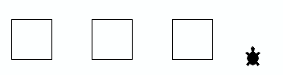
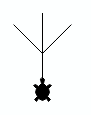

# Solutions du chapitre 3

## Activités 1

::: tip Remarque

Ce corrigé n'est pas encore disponible

:::

## Activités 2

::: tip Remarque

Ce corrigé n'est pas encore disponible

:::

## Activités 3

::: tip Remarque

Ce corrigé n'est pas encore disponible

:::

## Activité 11

::: tip Conseil d'apprentissage

Cet exercice peut se révéler plus périlleux qu'il n'y paraît. Le but n'est
simplement de trouver une solution bancale en tâtonnant pendant des heures mais
d'élaborer une stratégie réfléchie. Ce qui est attendu de vous à ce stade, c'est
que vous ayez le réflexe de prendre une feuille de papier et un crayon et que
vous élaboriez vos programmes et votre stratégie de manière réfléchie.

:::

### Partie A

Ce problème n'est pas très difficile à décomposer intelligemment. Il s'agit
clairement de définir d'abord une commande qui dessine un demi-cercle

```python webtj[autorun, width=100%]
from gturtle import *

def demi_cercle():
    repeat 180:
        forward(1)
        right(1)

makeTurtle()
demi_cercle()
```

On remarque cependant que cette commande `demi_cercle()` est assez lente. Pour
l'optimiser, il suffit de dessiner un demi-polygone avec moins de côtés :

```python webtj[autorun, width=100%]
from gturtle import *

def demi_cercle():
    repeat 18:
        forward(10)
        right(10)

makeTurtle()
demi_cercle()
```

qui ressemble encore tout autant à un cercle. Il suffit ensuite de répéter cette
commande 8 fois pour dessiner la figure tout en veillant à replacer la tortue
dans le bon sens pour qu'elle puisse dessiner le prochain motif (demi-cercle).

```python webtj[autorun, width=100%]
from gturtle import *

def demi_cercle():
    repeat 18:
        forward(10)
        right(10)

makeTurtle()

repeat 8:
    demi_cercle()
    right(180)
```

::: warning Attention

Les plus attentifs auront remarqué que la tortue ne dessine pas vraiment ce qui
est demandé dans la consigne. On le voit mieux si l'on diminue encore le nombre
et la taille des côtés.

```python webtj[autorun, width=100%]
from gturtle import *

def demi_cercle():
    repeat 9:
        forward(5)
        right(20)

def decaler_a_gauche():
    hideTurtle()
    penUp()
    left(90)
    forward(120)
    right(90)
    penDown()
    showTurtle()

makeTurtle()
decaler_a_gauche()
hideTurtle()
repeat 8:
    demi_cercle()
    right(180)

```

La raison pour laquelle la tortue monte est assez subtile! Pour bien comprendre
ce qui se passe, il faut encore diminuer le nombre de segments utilisés pour
dessiner le demi-cercle et agrandir leur longueur.

```python webtj[autorun, width=100%]
from gturtle import *

def demi_cercle():
    repeat 180 / 30:
        forward(40)
        right(30)


makeTurtle()
demi_cercle()

```

Pour que le demi-cercle se dessine correctement, il faut en fait modifier la
manière de dessiner le demi-cercle. Voyez-vous comment le faire?

Il faut essentiellement répéter le motif

```python
forward(20)
right(30)
forward(20)
```

au lieu de

```python
forward(40)
right(30)
```

On obtient donc le code suivant pour dessiner le demi-cercle de manière symétrique :

```python webtj[autorun, width=100%]
from gturtle import *

def demi_cercle():
    repeat 180 / 30:
        forward(20)
        right(30)
        forward(20)


makeTurtle()
demi_cercle()
```

:::

En augmentant de nouveau le nombre de côtés, on obtient la forme désirée :

```python webtj[autorun, width=120%]
from gturtle import *

def demi_cercle():
    repeat 18:
        forward(2)
        right(10)
        forward(2)

def decaler_a_gauche():
    hideTurtle()
    penUp()
    left(90)
    forward(120)
    right(90)
    penDown()
    showTurtle()

makeTurtle()
decaler_a_gauche()
hideTurtle()
repeat 8:
    demi_cercle()
    right(180)
```

### Partie B

Il y a plusieurs manières intelligentes de dessiner cette figure. Il s'agit dans
tous les cas d'identifier les motifs qui se répètent.

Le premier motif consiste à répéter trois carrés :

```python webtj[autorun, width=120%, speed=20]
from gturtle import *

def carre():
    repeat 6:
        forward(50)
        right(90)

def motif():
    repeat 3:
        # dessiner le motif
        carre()
        # repositionner la tortue pour dessiner le prochain motif
        right(180)

setPos(-200,-50)
makeTurtle()
motif()
```

::: tip Remarque

- Pour raccourcir le programme, on se permet de dessiner le carré de manière un
  peu spéciale, en répétant 6 fois au lieu de 4. Ceci permet de placer la tortue
  directement au sommet supérieur droit du carré.

- La commande `setPos(x, y)` permet de placer la tortue au pixel de
  coordonnées $(x, y)$ dans la fenêtre de dessin. Elle permet d'éviter de
  devoir écrire plein de commandes avec `penUp()`, `penDown()` etc.

- On voit que la commande `carre()` est une sortie de "sous-motif" de la
  commande `motif()`. La logique pour répéter un motif est toujours la même :

  ```python
  def dessine_figure():
      repeat NOMBRE_DE_REPETITIONS:
          dessine_motif()
          repositionne_tortue()
  ```

  :::

La même logique s'applique pour dessiner la figure en entier. Il suffit de faire

```python
def figure():
    repeat 2:
        # répétition du motif
        motif()
        # repositionnement de la tortue pour
        # dessiner le motif suivant
        right(90)
        back(50)
```

Cela donne au final le programme suivant :

```python webtj[autorun, width=120%]
from gturtle import *

def carre():
    repeat 6:
        forward(50)
        right(90)

def motif():
    repeat 3:
        # dessiner le motif
        carre()
        # repositionner la tortue pour dessiner le prochain motif
        right(180)

def figure():
    repeat 2:
        # répétition du motif
        motif()
        # repositionnement de la tortue pour
        # dessiner le motif suivant
        right(90)
        back(50)

setPos(-200,-50)
makeTurtle()
figure()
```

#### Variante

Il est également possible de dessiner le motif en escalier de la manière
suivante:

```python webtj[autorun, width=120%, speed=20]
from gturtle import *

def escalier():
    repeat 3:
        back(50)
        right(90)
        back(50)
        left(90)

setPos(0,50)
makeTurtle()
escalier()
right(180)
```

En répétant deux fois cet escalier avec une rotation de $180°$ entre les deux,
on obtient à nouveau le motif présenté dans la première version:

```python webtj[autorun, width=120%, speed=20]
from gturtle import *

def escalier():
    repeat 3:
        back(50)
        right(90)
        back(50)
        left(90)

def motif():
    repeat 2:
        escalier()
        right(180)

setPos(0,50)
makeTurtle()
motif()
```

Ce programme est même plus naturel que celui qui utilise le carré comme motif de
base pour réaliser la commande `motif()`.

### Partie C

Il y a beaucoup de motifs que l'on peut répéter pour obtenir le dessin souhaité.
Voici les plus évidents:

#### Variante 1

La première variante consiste à répéter une rangée de trois carrés:



que l'on peut dessiner avec la commande

```python
def motif():
    repeat 3:
        carre()
        penUp()
        right(90)
        forward(2 * 50)
        left(90)
        penDown()
```

La figure entière s'obtient en répétant ce motif deux fois et en dessinant
encore un carré supplémentaire. Il faut bien évidemment repositionner la tortue
avec la commande `deplacement()` entre

```python webtj[width=120%, autorun, speed=20]
from gturtle import *

def carre():
    repeat 4:
        forward(50)
        right(90)

def motif():
    repeat 3:
        carre()
        penUp()
        right(90)
        forward(2 * 50)
        left(90)
        penDown()

def deplacement():
    penUp()
    left(90)
    forward(7 * 50)
    right(90)
    back(100)
    penDown()


def figure():
    motif()
    deplacement()
    motif()
    carre()

setPos(-100, 0)
makeTurtle()
figure()
```

#### Variante 2

Une deuxième variante consiste à utiliser le motif suivant composé de deux
carrés "décalés":


que se dessine avec la commande

```python
def motif():
    repeat 2:
        # sous-motif
        carre()
        # repositionnement pour dessiner
        # le motif suivant
        penUp()
        right(180)
        forward(50)
        penDown()
```

Voici un exemple de programme qui dessine la figure en entier:

```python webtj[autorun, speed=20, width=120%]
from gturtle import *

def carre():
    repeat 6:
        forward(50)
        right(90)

def motif():
    repeat 2:
        # sous-motif
        carre()
        # repositionnement pour dessiner
        # le motif suivant
        penUp()
        right(180)
        forward(50)
        penDown()

def figure():
    repeat 3:
        # dessin du motif
        motif()
        # repositionnement
        penUp()
        back(4 * 50)
        penDown()
    # dessin du dernier carré isolé
    carre()

setPos(-150, -50)
makeTurtle()
figure()
```

::: tip Remarque générale

Vous pouvez constater que les programmes présentés sont bien structurés avec
différentes commandes. Pour les parties B et C, on a tout d'abord un sous-motif
`carre()` qui est répété un certain nombre de fois pour former un motif
`motif()`, également répété un certain nombre de fois pour réaliser la figure
dans son entier avec la commande `figure()`.

Cette manière de structurer un programme en programmes et sous-programmes est
l'essence même de la programmation modulaire et constitue une compétence
fondamentale en programmation. Cela permet d'écrire des programmes plus courts,
mieux structurés, plus facilement compréhensibles et comportant moins d'erreurs.

:::

## Activité 12 (facultatif)

Aucun corrigé n'est disponible pour cette activité peu importante.

## Activité 13

::: warning Exercices 13-16

Les exercices 13 à 16 sont facultatifs dans le cadre de ce chapitre. Ils
pourront être réalisés de manière bien plus efficace en définissant des
commandes avec paramètres qui permettront de réaliser une seule commande
permettant de colorier des rectangles de n'importe quelle dimension.

Nous dessinerons l'échiquier de l'exercice 16 de cette manière bien plus
appropriée au chapitre 4. Pour le moment, vous pouvez donc sans problème ignorer
les activités 13 à 16 et tout ce qui concerne le coloriage de carrés et de rectangles.

:::

La raison pour laquelle la commande `carre_plein()` est

```python
def carre_plein():
    repeat 99:
        ligne_epaisse()
```

et répète ainsi 99 fois `ligne_epaisse()` est que si l'on ne répète
`ligne_epaisse()` qu'une seule fois, on colorie déjà deux colonnes de pixels
comme le montre le programme suivant :

```python webtj[autorun, speed=1]
from gturtle import *


def ligne_epaisse():
    forward(100)
    right(90)
    forward(1)
    right(90)
    forward(100)
    right(180)

makeTurtle()
repeat 1:
    ligne_epaisse()
```

À chaque fois que la commande `ligne_epaisse()` est exécutée, une des deux
colonnes de pixels peinte recouvre en fait une autre colonne de pixels déjà
peinte précédemment. Donc si l'on appelle `ligne_epaisse()` deux fois de suite,
il y a trois colonne de pixels peintes. De ce fait, pour colorier $N$ colonnes,
il faut répéter $N-1$ fois la commande `ligne_epaisse()`.

::: tip Discussion (facultatif : optimisation)

On pourrait évidemment proposer plusieurs optimisations pour réaliser le dessin
de manière plus efficace.

Modifier la commande `ligne_epaisse()` pour ne pas repasser à chaque fois
sur chaque colonne de pixels. Pour cela, il suffirait de modifier la
commande de la manière suivante:

```python webtj[autorun, speed=2]
from gturtle import *

def ligne_epaisse():
    forward(100)
    right(90)
    forward(1)
    right(90)
    forward(100)
    left(90)
    forward(1)
    left(90)

makeTurtle()
repeat 1:
    ligne_epaisse()
```

Le problème avec cette commande est qu'il n'est plus possible de colorier un
nombre impair de colonnes. En revanche, avec cette variante de la commande
`ligne_epaisse()`, il suffit de répéter $N/2$ fois la boucle `repeat`. Si l'on
veut colorier un nombre impair de colonnes, il suffit ensuite peindre
uniquement la dernière.

```python webtj[autorun, hideTurtle]
from gturtle import *

def ligne_epaisse_2():
    forward(100)
    right(90)
    forward(1)
    right(90)
    forward(100)
    left(90)
    forward(1)
    left(90)


def carre_plein():
    repeat 50:
        ligne_epaisse_2()

makeTurtle()
carre_plein()
```

:::

## Activité 14

La solution est donnée ici sans explication car cet exercice sera de toute
manière réalisé de manière plus efficace en utilisant les paramètres au
chapitre. Il faut modifier à la fois la commande `ligne_epaisse()` et le nombre
de répétitions

```python webtj[autorun, speed=30]
from gturtle import *

def ligne_epaisse():
    forward(75) # <= ligne modifiée par rapport à l'exemple 10
    right(90)
    forward(1)
    right(90)
    forward(75) # <= ligne modifiée par rapport à l'exemple 10
    right(180)

def carre_plein():
    repeat 74:  # <= ligne modifiée par rapport à l'exemple 10
        ligne_epaisse()

makeTurtle()
carre_plein()
```

## Activité 15 (facultatif)

La solution n'est pas donnée car cet exercice est très similaire au précédent.

## Activité 16 (facultatif)

::: tip Conseil

L'exercice 16 est un projet de plus grande envergure qui vise à assembler tous
les exercices précédents. Il faut procéder par étapes et identifier les
différents motifs à répéter qui constituent un échiquier.

Le problème est facultatif car il sera traité de manière plus détaillée et plus
efficace aux pages 53 à 55 du chapitre 4 sur les commandes avec paramètres.

:::

## Activité 17, page 39 (facultatif)

::: tip Conseil

Le problème 17 est facultatif. Nous allons plutôt entraîner les animations dans
les projets 6 et 7 à la page 41 du livre.

:::

## Questions de compréhension, page 40

1.  Le mot-clé `repeat` permet de répéter des bouts de programmes sans avoir à
    faire du copier-coller. Cela permet de respecter le principe DRY de
    l'informatique.

    ::: tip DRY

    En programmation, principe DRY = Don't Repeat Yoursel est fondamental. Il
    s'agit en quelque sorte du "premier commandement" de la programmation. Le
    code ci-dessous pour dessiner un hexagone n'est par exemple pas DRY car il
    s'obtient par copier-coller.

    ```python
    forward(50)
    right(60)
    forward(50)
    right(60)
    forward(50)
    right(60)
    forward(50)
    right(60)
    forward(50)
    right(60)
    forward(50)
    right(60)
    ```

    Une manière DRY d'écrire le même code avec la boucle `repeat` est la
    suivante:

    ```python
    repeat 6:
        forward(50)
        right(60)
    ```

    :::

    L'utilisation des boucles `repeat` économise donc beaucoup de temps dans les
    situations suivantes:

    - Dessin de formes qui présentent des régularités (motifs récurrents)
    - Dessin de polygones réguliers
    - De manière générale, pour effectuer des actions répétitives
    - Bien d'autres situations que nous traiterons plus tard, notamment la
      lecture de données depuis le capteur d'un robot ou d'une carte de
      développement Oxocard ou la gestion des événements (clavier, souris et
      autres).

    ::: tip Remarque

    La boucle `repeat` permet uniquement de répéter un bout de code qui est
    toujours identique. Il exsite en Python encore deux autres types de boucles
    permettant de répéter des bouts de codes et qui s'utilisent dans des
    situations différents : la boucle `for` qui permet d'exécuter un programme
    pour chaque élément d'une liste et la boucle `while` qui permet de répéter
    un programme tant qu'une condition reste vraie.

    :::

2.  La syntaxe de la boucle `repeat` est la suivante:

    ```python
    repeat NOMBRE_DE_REPETITIONS:
        corps_de_la_boucle()
    ```

3.  Le **corps** de la boucle est décalé par rapport au `repeat` et indique ce
    qui doit être répété. Le **corps** de la boucle doit être décalé par rapport à l'**en-tête** de la
    boucle.

4.  Pour dessiner des animations, il faut dessiner et effacer successivement et
    un grand nombre de fois une forme qui se déplace légèrement d'une fois à
    l'autre. Sans les boucles, il faudrait recopier des centaines de lignes de
    code qui peuvent simplement être répétées avec la boucle `repeat`.
    `
5.  Oui, il est tout-à-fait possible d'utiliser une boucle `repeat` dans le
    corps d'une autre boucle `repeat`. On parle dans ce cas de **boucle
    imbriquée**. L'exemple 7 à la page 36 montre un bon exemple de boucle
    imbriquée.

6.  Bien qu'il soit possible d'imbriquer les boucles les unes dans les autres,
    il vaut généralement la peine d'inclure la boucle imbriquée dans une
    commande qui lui est propre. Cette commande pourra ensuite être utilisée
    dans le corps de la boucle `repeat` principale. Cela permet de rendre le
    programme plus compréhenisble.

    L'exemple 8 fait la même chose que l'exemple 7 mais il est bien plus
    compréhensible car la boucle interne est insérée dans la commande
    `quart_cercle()`

7.  Non. Mathématiquement, on peut définir un cercle comme la limite lorsque $N
    \to \infty$ (Prononcer "lorsque $N$ tend vers l'infini") d'un polygone
    régulier à $N$ côté. Dit plus simplement pour le commun des mortels, un
    cercle est un polygone régulier possédant "une infinité de côtés". Le
    problème est qu'il est absolument impossible de stocker une infinité de
    choses dans un ordinateur ni d'ailleurs de lui faire faire une infinité de
    choses. L'ordinateur peut donc au mieux dessiner de manière
    **approximative** un cercle par un polygone régulier à $N$ côtés.

8.  Plus le nombre de côtés du polygone régulier est grand, plus il ressemblera
    à un cercle mais plus cela demandera de travail à l'ordinateur. Puisque
    l'oeil humain a des capacités finies également et que l'écran de
    l'ordinateur ne possède de toute manière qu'un nombre limité de pixels, on
    pourra généralement se contenter de dessiner un cercle par un polygone
    régulier de 36 côtés. Cela dépend toutefois du rayon du cercle. Plus le
    rayon du cercle est grand, plus le nombre de côtés nécessaire sera élevé
    pour que les côtés ne puissent pas être distingués à l'oeil.

## Exercice 1, page 41

Pour répondre à la question sans ordinateur il faut se munir d'une feuille de
papier et d'un crayon en faisant attention aux éléments suivants:

- Où se trouve la tortue avant et après l'exécution d'un bout de code (par
  exemple avant et après chaque répétition de la boucle `repeat 4`)

- Il faut aussi faire bien attention à l'orientation de la tortue avant et après
  un dessin.

```python webtj[autorun, speed=20]
from gturtle import *
makeTurtle()
setPos(-200, 0)
repeat 12:
    repeat 4:
        forward(30)
        right(90)
    right(90)
    forward(30)
    left(90)
```

::: warning Commande setPos(x,y)

Comme l'indique la documentation de WebTigerJython, la commande `setPos(x, y)`
permet de positionner la tortue à une coordonnée absolue de la fenêtre de
dessin. Elle est utilisée ici pour que le dessin tienne dans la partie visible
de la fenêtre mais elle ne change rien au dessin.

:::

## Exercice 2, page 41

La conception modulaire consiste à décomposer le problème en sous-problèmes plus
simples qu'il est ensuite facile d'assembler pour résoudre le problème dans son
ensemble. Dans notre cas, la boucle interne `repeat 4:` gagnerait à se trouver
dans une commande à part qui décrit ce que cette boucle fait. Elle dessine un
carré. Il vaut donc mieux la placer au sein d'une commande `carre()`

```python
def carre30():
    repeat 4:
        forward(30)
        right(90)
```

Cela donne au final le programme suivant bien plus compréhensible:

```python webtj[width=100%, autorun]
from gturtle import *

def carre30():
    repeat 4:
        forward(30)
        right(90)

def deplacement():
    right(90)
    forward(30)
    left(90)

setPos(-200, 0)
makeTurtle()
repeat 12:
    carre30()
    deplacement()

```

::: tip Note

La commande `setPos(x, y)` utilisée à la ligne 13 ne sert qu'à centrer l'image
dans le fenêtre de dessin pour que tout le dessin soit visible lorsque la
fenêtre est réduite.

:::

## Exercice 3, page 41

L'exercice 3 n'est pas d'une importance capitale dans ce chapitre. Il mêle
cependant deux manière de répéter du texte:

1.  Utiliser l'instruction `repeat`
2.  Utiliser l'opérateur `*` qui "multiplie du texte par un nombre" en répétant
    le texte en question.

Fondamentalement, le programme est équivalent à

```python
print 5 * "pomme "
print 5 * "pomme "
print 5 * "pomme "
print 2 * "pomme ", "ver ", 2 * "pomme "
print 5 * "pomme "
print 5 * "pomme "
```

::: tip Remarque

Pour bien effectuer cet exercice, il faut procéder petit-à-petit pour chacune des
commandes.

La commande `print 5 * "pomme "` donne par exemple le résultat

```
pomme pomme pomme pomme pomme
```

et la commande `print 2 * "pomme ", "ver ", 2 * "pomme "` est équivalente à la
commade

```python
print "pomme pomme ", "ver ", "pomme pomme "
```

qui donne la sortie

    pomme pomme ver pomme pomme

:::

Le programme dans son ensemble

```python webtj[autorun]
repeat 3:
    print 5 * "pomme "
print 2 * "pomme ", "ver ", 2 * "pomme "
repeat 2:
    print 5 * "pomme "
```

donne donc la sortie

```
pomme pomme pomme pomme pomme
pomme pomme pomme pomme pomme
pomme pomme pomme pomme pomme
pomme pomme  ver  pomme pomme
pomme pomme pomme pomme pomme
pomme pomme pomme pomme pomme
```

## Exercice 4, page 41

Le motif de base à répéter dans cet exercice est assez évident. Il s'agit d'une
"branche" du flocon de neige. Pour que l'on puisse facilement dessiner tout le
flocon de neige en répétant la branche et en tournant de $60°$, il faut que la
tortue débute et termine la branche au centre du flocon et dans la même
orientation.



::: tip Remarque

Remarquez que la tortue débute et termine le dessin au même endroit, au centre
du flocon, à savoir en bas de la branche, en regardant dans la même direction.
Cela permet ensuite de simplement répéter plusieurs fois la commande `branche()`
depuis le centre du flocon en tournant simplement de $60°$ entre chaque branche.

:::

```python
def branche():
    forward(40)
    left(45)
    repeat 3:
        forward(40)
        back(40)
        right(45)
    left(90)
    back(40)
```

Voici le programme en entier.

```python webtj[autorun]
from gturtle import *

def branche():
    forward(40)
    left(45)
    repeat 3:
        forward(40)
        back(40)
        right(45)
    left(90)
    back(40)

def flocon():
    repeat 6:
        branche()
        right(60)

makeTurtle()
flocon()
```

## Exercice 5, page 41

Comme pour l'activité 11, page 37, il faut utiliser le motif suivant pour
dessiner un demi-cercle si l'on veut qu'il soit symétrique:

```python
repeat NOMBRE_DE_SEGMENTS:
    forward(LONGUEUR_SEGMENT / 2)
    right(180 / NOMBRE_DE_SEGMENTS)
    forward(LONGUEUR_SEGMENT / 2)
```

et non le motif

```python
repeat NOMBRE_DE_SEGMENTS:
    forward(LONGUEUR_SEGMENT)
    right(180 / NOMBRE_DE_SEGMENTS)
```

qui ne donne pas un beau demi-cercle. Le programme complet est donc

```python webtj[autorun]
from gturtle import *

def demi_cercle_droite():
    repeat 15:
        forward(2.5)
        right(180 / 15)
        forward(2.5)

def demi_cercle_gauche():
    repeat 15:
        forward(2.5)
        left(180 / 15)
        forward(2.5)

def grand_cercle():
    repeat 36:
        forward(300 / 36)
        left(360 / 36)


def figure():
    demi_cercle_droite()
    demi_cercle_gauche()
    grand_cercle()

makeTurtle()
figure()
```

::: tip Remarque

Nous verrons dans le prochain chapitre comment écrire un tel programme de
manière plus élégante et succincte en n'écrivant qu'une seule commande
`arc_cercle(angle, perimetre)` qui permet de dessiner tous les arcs de cercles
qui apparaissent dans ce problème.

:::

## Exercice 6, page 41 (Projet)

::: tip Information

La solution du projet n'est pas donnée sur cette page. Il est important que vous
fassiez votre maximum pour résoudre ce problème par vous-mêmes. Si vous avez
l'occasion de travailler ce problème en classe, mettez-vous par deux pour le
réaliser.

Une solution détaillée sera livrée ultérieurement dans la partie "Travaux pratiques et projets" du site.

:::

## Exercice 7, page 41 (Projet)

::: tip Information

La solution du projet n'est pas donnée sur cette page. Il est important que vous
fassiez votre maximum pour résoudre ce problème par vous-mêmes. Si vous avez
l'occasion de travailler ce problème en classe, mettez-vous par deux pour le
réaliser.

Une solution détaillée sera livrée ultérieurement dans la partie "Travaux pratiques et projets" du site.

:::

